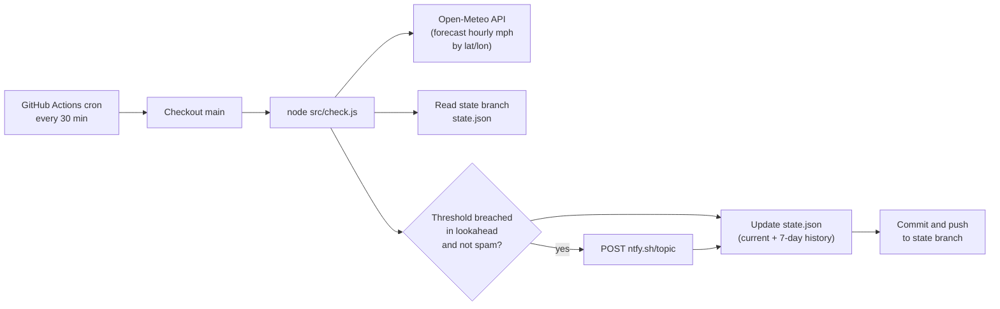

# GreenhouseAlert

**Get a phone notification before high winds hit your greenhouse — free, open source, no phone numbers.**

Born from a narrow greenhouse that fell over twice in the wind. This little bot checks the forecast every 30 minutes and pings you (and anyone you share the alert with) when gusts or sustained wind are expected to exceed your thresholds — *before* they arrive.

---

## What it does 🌬️

- Monitors wind forecasts via [Open-Meteo](https://open-meteo.com/) (free, no API key)
- Sends push notifications through [ntfy.sh](https://ntfy.sh) (free, Android + iOS)
- Runs on GitHub Actions on a 30-minute schedule (free for public repos)
- Alerts **up to N hours before** the wind hits (configurable)
- Separate thresholds for **gusts** and **sustained** wind
- Supports **multiple recipients** — anyone subscribed to your topic gets the alert
- Keeps a **7-day history** on a `state` branch you can browse on GitHub
- **No phone numbers**, no API keys, no secrets in the codebase

---

## How it works ⚙️



1. GitHub Actions runs `src/check.js` every 30 minutes.
2. The script fetches hourly wind forecast for your lat/lon.
3. It looks at the next *N* hours (your `leadTimeHours` setting).
4. If gusts or sustained wind exceed your thresholds, it sends a push via ntfy — unless it already notified you recently (anti-spam).
5. Run history is saved to `state/state.json` on the `state` branch.

---

## Quick start (fork & go) 🚀

### 1. Fork this repo

Click **Fork** on GitHub, then clone your fork if you like — you don't need to clone it for the bot to run; Actions runs in the cloud.

### 2. Install the ntfy app

Everyone who wants alerts needs the app and must subscribe to the same topic:

- [Google Play (Android)](https://play.google.com/store/apps/details?id=io.heckel.ntfy)
- [App Store (iOS)](https://apps.apple.com/us/app/ntfy/id1625396347)
- [F-Droid](https://f-droid.org/en/packages/io.heckel.ntfy/)

### 3. Pick a random topic name

This is your shared secret — like a password for the notification channel. Make it long and unguessable:

```bash
openssl rand -hex 12
```

Or mash the keyboard for 20+ random characters. Example: `greenhouse-alert-x9k2p7q1m4n8`

### 4. Subscribe to the topic in ntfy

Open the app → **Subscribe to topic** → enter your topic name.

Every person who should get alerts (you, your partner, etc.) repeats this step on their own phone. No code changes needed.

### 5. Find your latitude and longitude

You need the coordinates of your greenhouse (or wherever you want wind checked):

- [latlong.net](https://www.latlong.net/) — search for your place and copy the coordinates
- **Google Maps** — right-click the spot → the coordinates appear at the top (lat first, then lon)

Example: `51.5074` and `-0.1278`

### 6. Add GitHub Secrets

In your fork: **Settings → Secrets and variables → Actions → New repository secret**

| Secret name     | Example value              | Description                          |
|-----------------|----------------------------|--------------------------------------|
| `NTFY_TOPIC`    | `greenhouse-alert-x9k2p7q1` | The topic from step 3               |
| `LOCATION_LAT`  | `51.5074`                  | Latitude (-90 to 90)                 |
| `LOCATION_LON`  | `-0.1278`                  | Longitude (-180 to 180)              |

### 7. Enable Actions and test

1. Go to the **Actions** tab in your fork.
2. If prompted, click **I understand my workflows, go ahead and enable them**.
3. Open **Check wind** → **Run workflow** → **Run workflow** to do a manual test run.
4. Check the run log — you should see `Location: lat=*** lon=***` (coordinates are never printed).

### 8. Tune `config.json` (optional)

Edit thresholds and lead time in [`config.json`](config.json) on your `main` branch. Safe to commit — no secrets in this file.

---

## Configuration reference 📋

All settings live in [`config.json`](config.json):

| Key | Default | What it does |
|-----|---------|--------------|
| `sustainedThresholdMph` | `30` | Alert if **sustained** wind (10 m) reaches this speed |
| `gustThresholdMph` | `45` | Alert if **gusts** reach this speed |
| `leadTimeHours` | `2` | Look this many hours ahead for breaches |
| `checkWindowHours` | `24` | How much forecast to fetch each run |
| `renotifyCooldownHours` | `6` | Minimum hours between repeat alerts for the same event |
| `renotifyIfGustIncreasesByMph` | `5` | Send an "updated forecast" if peak gust jumps by this much |
| `bypassAntiSpam` | `false` | **Testing only.** If `true`, sends an alert on every breach even if one was sent recently. Set back to `false` when done |
| `timezone` | `Europe/London` | Timezone for times shown in notifications |

**Tip:** Narrow greenhouses often fail from **gusts**, not average wind. Many setups use a lower sustained threshold and a higher gust threshold — adjust to what your structure can handle (check manufacturer guidance if you have it).

---

## Adding more recipients 👥

Anyone who:

1. Installs the ntfy app, and
2. Subscribes to your **same topic name**

…will receive every alert. Share the topic via a private message — treat it like a password.

---

## Seeing the history 📊

After a few runs, open the **`state`** branch on GitHub and view [`state.json`](https://github.com/YOUR_USER/GreenhouseAlert/blob/state/state.json).

It keeps the last **7 days** of stats: how many times the bot ran, max forecast wind, breaches detected, and each notification sent (with reason: `first-breach`, `gust-increased`, or `cooldown-expired`). Handy for curiosity and debugging.

---

## Local development 💻

```bash
git clone https://github.com/YOUR_USER/GreenhouseAlert.git
cd GreenhouseAlert
npm install
```

Create a `.env` file (never commit this):

```env
NTFY_TOPIC=your-topic-here
LOCATION_LAT=51.5074
LOCATION_LON=-0.1278
```

Dry run (no notification, no state write):

```bash
npm run check:dry-run
```

Live run locally (will notify and update `state/state.json`):

```bash
npm run check
```

---

## Security notes 🔒

- **Never** paste your `NTFY_TOPIC`, `LOCATION_LAT`, or `LOCATION_LON` into GitHub Issues, PRs, screenshots, or public chats.
- Secrets live only in **GitHub Actions Secrets** (or local `.env`). They are not in `config.json` or the `state` branch.
- Logs intentionally show `lat=*** lon=***` only.
- If your topic leaks, rotate it: change the `NTFY_TOPIC` secret and re-subscribe in the ntfy app. No code change needed.
- Pull requests from forks **cannot** read your repository secrets (GitHub default).

---

## Troubleshooting 🔧

| Problem | What to try |
|---------|-------------|
| No notifications | Confirm all three secrets are set; run workflow manually; check ntfy app is subscribed to the exact topic |
| Workflow not running | Actions may be disabled — enable in the Actions tab. Scheduled workflows pause after **60 days** of repo inactivity ([docs](https://docs.github.com/en/actions/using-workflows/disabling-and-enabling-a-workflow)) |
| Wrong location | Double-check lat/lon aren't swapped; lat is -90…90, lon is -180…180 |
| Too many alerts | Raise thresholds or increase `renotifyCooldownHours` |
| Too few alerts | Lower thresholds or increase `leadTimeHours` |
| Testing ntfy / repeat alerts | Set `"bypassAntiSpam": true` temporarily (still needs a forecast breach). Use low thresholds to force a breach, then set `bypassAntiSpam` back to `false` |
| State branch missing | First successful run creates it automatically |

---

## Credits & licence 📜

- Weather data: [Open-Meteo](https://open-meteo.com/) — [CC BY 4.0](https://creativecommons.org/licenses/by/4.0/)
- Push notifications: [ntfy.sh](https://ntfy.sh)
- This project: [MIT Licence](LICENSE)

---

*Stay safe, strap down that greenhouse, and happy gardening.*
